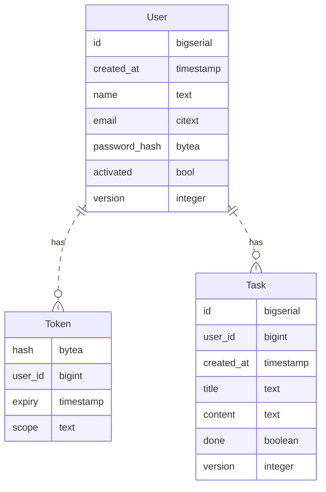
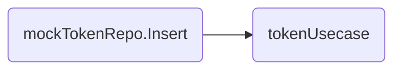
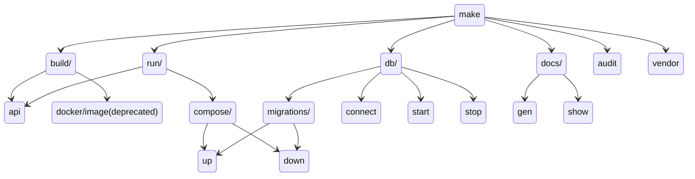
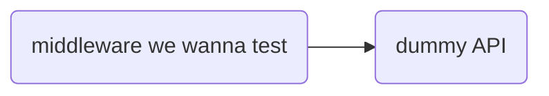
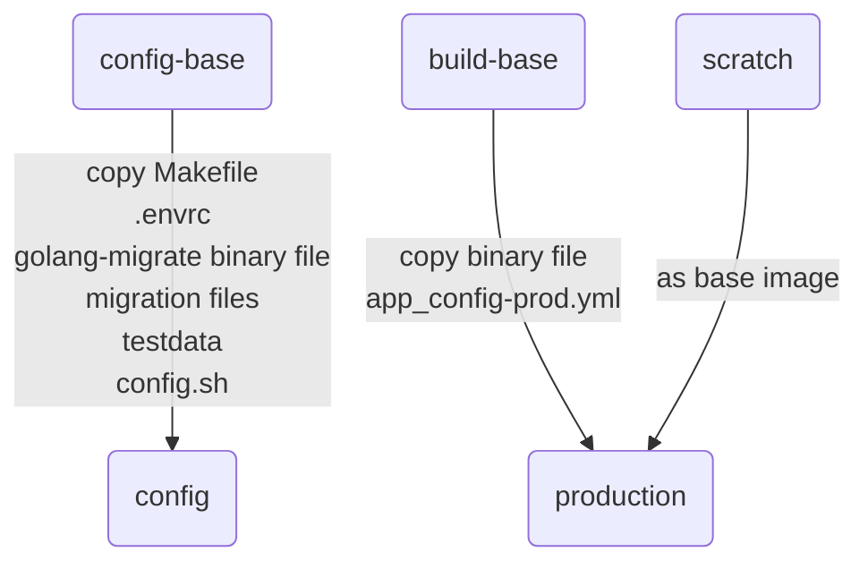
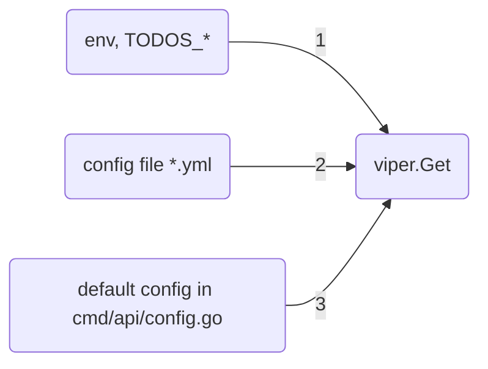
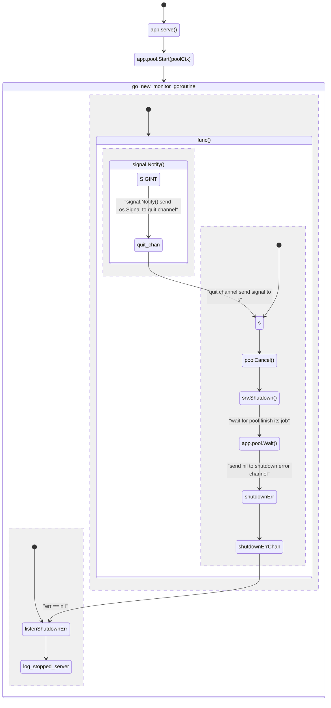

# TODOs: A todo-list written in Go, with Clean Architecture.


[](https://drone.unknowntpo.net/unknowntpo/todos)
[](https://cloud.drone.io/unknowntpo/todos) [](https://pkg.go.dev/github.com/unknowntpo/todos?utm_source=godoc) [](https://goreportcard.com/report/github.com/unknowntpo/todos) [](https://codecov.io/gh/unknowntpo/todos)

If github failed to render mermaid graphs, click the button below to see the Documentation at HackMD

[](https://hackmd.io/niPMhxhbSg-rNNzsj0Hrsw)

[TOC]
## Quick Start

## Project Walkthrough
### Database Schema
:construction: TODO: Display foreign key

### Clean Architecture
### Error Handling
#### Delivery
##### Reactor package
* :question:  Why Use Reactor package?
* :question: The `reactor.Context`
* :question: Why use `sync.Pool` in `reactor.Reactor.HandlerWrapper` ?
#### Usecase
* contains some business logic
* tested by mocking repository layer using [`stretchr/testify`](https://github.com/stretchr/testify)
    * e.g. If we want to test token usecase: 
        * we set up mock token repository 
        * set expectation
        * assert expectation is satisfied.
        * assert output of tokenUsecase is correct.
        * :construction: TODO: Finish the graph


* Repository
    * the code that make database conne to database
    * tested by `testcontainers`
    * 
####
#### Token
:question: How token is generated ?

:question: What is CSPRNG ?

A Cryptographically-secure pseudorandom number generator

:question: Why can't we use the output of `rand.Read()` as token.Hash ?
#### User
#### Task
### pkg / reactor
:question: Why I choose to implement package reactor?

Because I need an object that I can pass it to the layer which  needs to send / receive request, response.

Example:
At commit [`002524`](https://github.com/unknowntpo/todos/commit/0025248cec922dea9614e3e213f908d1bc8d9e4b)
in file `./internal/healthcheck/delivery/api/healthcheck_api.go`
```go
// Put reactor at structure that holds all the handler
type healthcheckAPI struct {
	version string
	env     string
	rc      *reactor.Reactor
}

type HealthcheckResponse struct {
	Status      string `json: "status"`
	Environment string `json: "environment"`
	Version     string `json: "version"`
}

// NewHealthcheckAPI registers all handlers in /v1/healcheck to the router.
func NewHealthcheckAPI(router *httprouter.Router, version, env string, rc *reactor.Reactor) {
	api := &healthcheckAPI{version: version, env: env, rc: rc}
	router.Handler(http.MethodGet, "/v1/healthcheck", rc.HandlerWrapper(api.Healthcheck))
}

// Healthcheck shows status of service.
// @Summary Show status of service.
// @Description None.
// @Produce json
// @Success 200 {object} HealthcheckResponse
// @Router /v1/healthcheck [get]
func (h *healthcheckAPI) Healthcheck(c *reactor.Context) error {
	return c.WriteJSON(http.StatusOK, &HealthcheckResponse{
		Status:      "available",
		Version:     h.version,
		Environment: h.env,
	})
}
```

:question: How does `*reactor.Reactor.HandlerWrapper` work with `Healthcheck` handler ?

The callgraph:

1. httprouter select the URL `/v1/healthcheck` and calls `(*Reactor).HandlerWrapper.func1.ServeHTTP(w, r)`
2. Attempt to get new `reactor.Context` instance, if reactor.Context is not in `sync.Pool`, `sync.Pool` will allocate a new one for us.
3. Store `w, r` inside reactor.Context
4. call `api.Healthcheck(c)`
5. if `api.Healthcheck` returns any error, we treat it as internal server error, log it and send response.


### Rate Limiter
* :question: LRU Cache ?
* :question: IP-Based rate limiter ?
* :question: What is token bucket ?
### Makefile

* include `.envrc` to set up
    * POSTGRES_USER
    * POSTGRES_PASSWORD
    * POSTGRES_DB
    * TODOS_APP_DB_DSN
    * TODOS_APP_DB_DSN_LOCAL
* Makefile command tree
    * we can use tab to do auto-complete
        * e.g. Type `$ make run/ + [tab]`
            * We get
                * `run/api`
                * `run/compose/down`
                * `run/compose/up`

### Testing
* Testcontainers v.s. sqlmock
    * Test on real database
* use build tag to seperate integration test and unit test
#### Middleware
* Create a API endpoint for every test
* Wrap the test api with middleware we wanna test.
* Assert the result we got in API endpoint is what we want.

#### Delivery/API
* Mock the usecase layer.
#### Usecase
* Mock the repository layer using `github.com/stretchr/testify/mock`
#### Repository
* Using TestContainers for test containers,
* It's a little slow, and it use external resources, so I classify repository test as part of integration tests.
### Dockerfile
#### Multi-stage build


* Parallel build
    * When we change content in build base, config won't be changed.
* `.envrc`
### Configuration management
* Use [spf13/viper](https://github.com/spf13/viper) for configuration management
* :question: The order of config variable parsing ?
* in `go doc viper.Get`
    * override, flag, env, config file, key/value store, default
    * We use env, config file, default only


### Graceful shutdown
:question:  How to represent goroutines ?
