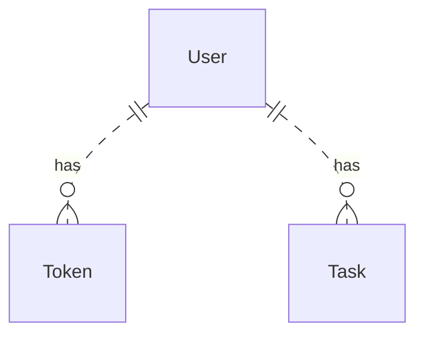
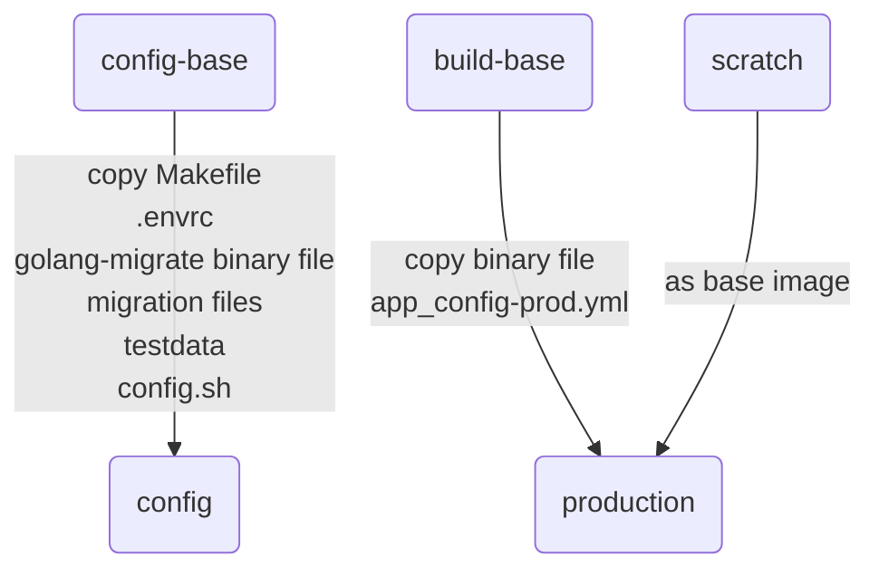

# TODOs: A todo-list written in Go, with Clean Architecture.

   

[TOC]
## Quick Start

## Project Walkthrough
### Database Schema

### Clean Architecture
### Makefile
### Testing
* Testcontainers v.s. sqlmock
    * Test on real database
* use build tag to seperate integration test and unit test

### Dockerfile
#### Multi-stage build

* Parallel build
    * When we change content in build base, config won't be changed.
* `.envrc`
### Configuration management
### Graceful shutdown